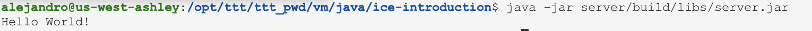

# Ice Middleware introduction 🎁

We will use Gradle to create our application projects. You must install Gradle before continuing with this tutorial.
Open a new Command Prompt and run the following commands to generate a new project:

The main design goals of **Ice** are:

- Provide an object-oriented RPC framework suitable for use in heterogeneous environments.
- Provide a full set of features that support development of realistic distributed applications for a wide variety of domains.
- Avoid unnecessary complexity, making the platform easy to learn and to use.
- Provide an implementation that is efficient in network bandwidth, memory use, and CPU overhead.
- Provide an implementation that has built-in security, making it suitable for use over insecure public networks.

## Initializing 🏗️

```bash
mkdir ice-introduction
cd ice-introduction
gradle init
```

## Configuration 🫰

For this demo we're going to use a project with two sub-projects to build the Client and Server applications. The requirements for our sub-projects are the same so we'll do all the setup in the subprojects block of the root project, which applies to all sub-projects. Edit the generated build.gradle file to look like the one below:

```gradle
...
"Class-Path": configurations.runtimeClasspath.resolve().collect { it.toURI() }.join(' ')
...
```

We must also edit the generated settings.gradle to define our sub-projects:

```gradle
rootProject.name = 'ice'
include 'client'
include 'server'
```

## Compiling the client and server ⭐️

```bash
./gradlew build
```

 ## Testing our distributed app 🐙

- At this point, we wont see anything because the server simply waits for a client to connect to it. We run the client in a different window:
    

- To run client and server, we first start the server in a separate window:
    

The client runs and exits without producing any output; however, in the server window, we see the "Hello World!" that is produced by the printer. To get rid of the server, we interrupt it on the command line for now. 